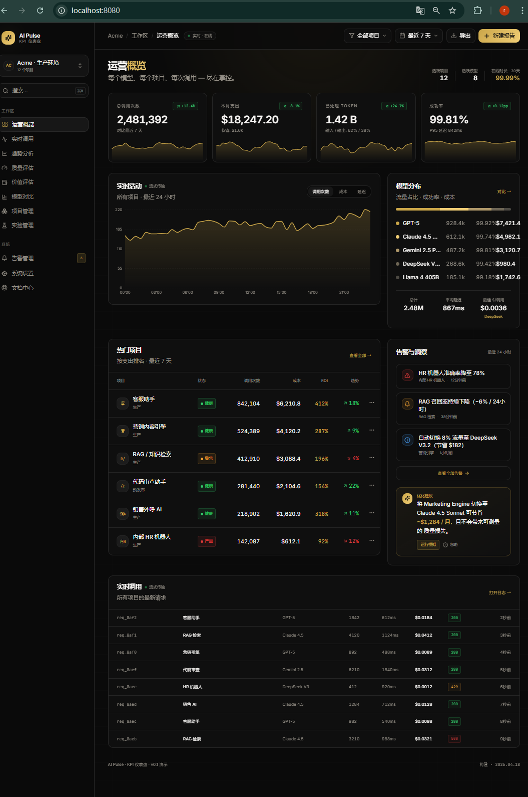
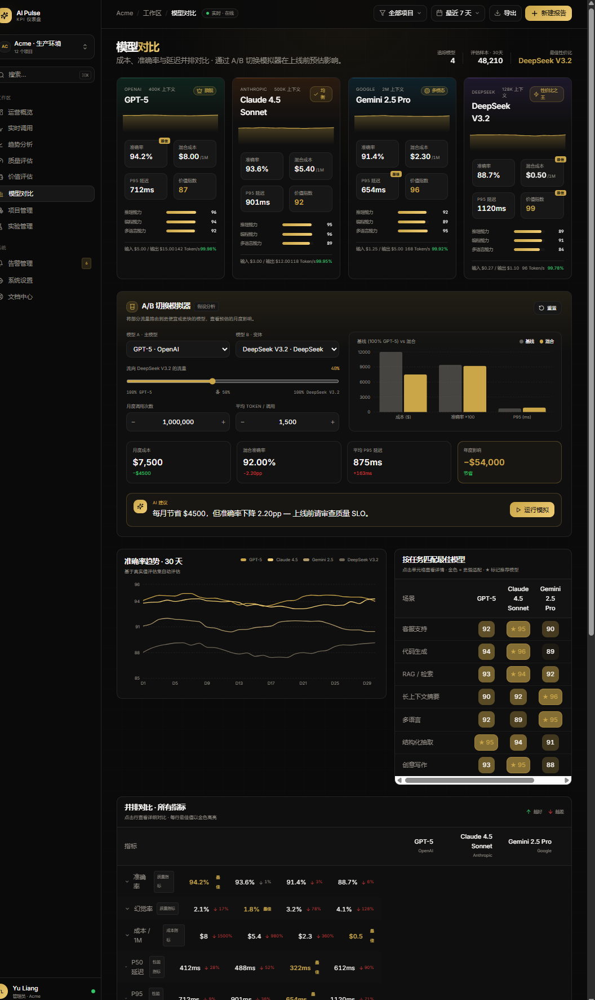
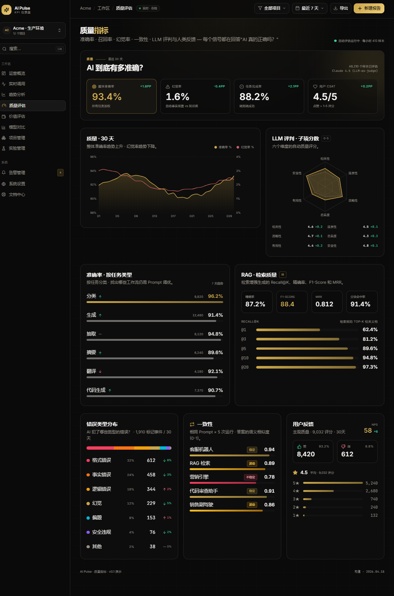
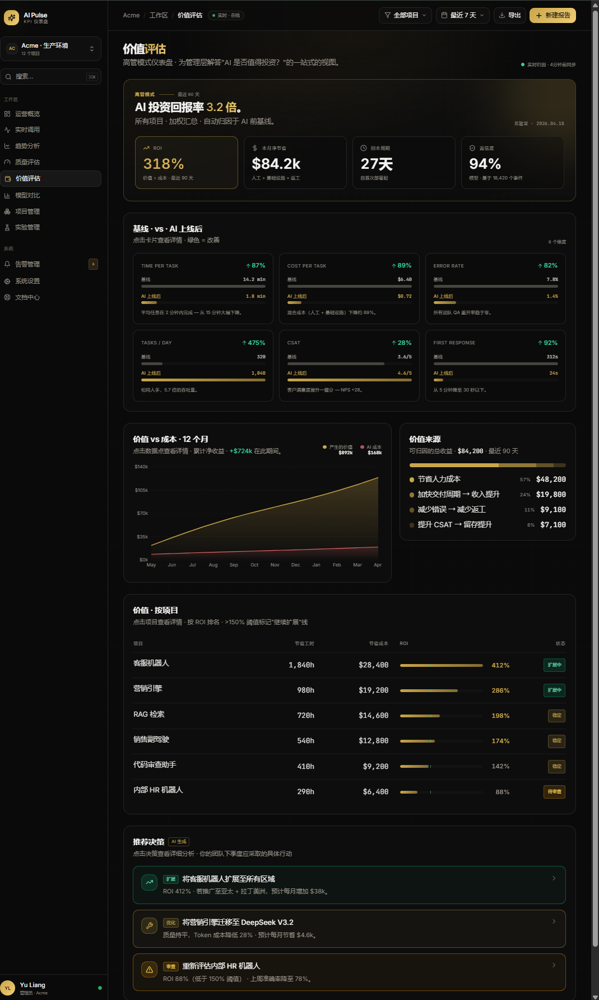

<div align="center">

# AI KPI 监控平台

**面向企业级 AI 应用的全链路 KPI 监控与价值评估系统**

覆盖 **监控 → 分析 → 决策** 完整闭环 · 8 大类 50+ KPI 指标 · 33 个 RESTful API 端点

[](https://www.python.org/)
[](https://fastapi.tiangolo.com/)
[](https://react.dev/)
[](https://www.typescriptlang.org/)
[](https://vitejs.dev/)
[](LICENSE)

</div>

---

## ✨ 功能亮点

### 🖥️ 11 个功能页面

| 页面 | 说明 |
|------|------|
| 📊 总览仪表盘 | 全局 KPI 一览，关键指标实时聚合 |
| 🔀 模型对比 | 多模型横评，性能/成本/质量多维对比 |
| 💰 价值评估 | ROI 量化分析，投资回报可视化 |
| 🎯 质量评估 | 准确率、RAG 检索质量、错误分布 |
| 📈 趋势分析 | 时序趋势追踪与预测 |
| 📡 实时调用 | LLM 调用流实时监控 |
| 📁 项目管理 | 多项目隔离与指标聚合 |
| 🧪 实验管理 | A/B 测试创建、运行与结果分析 |
| 🔔 告警管理 | 智能告警规则与历史追溯 |
| ⚙️ 系统设置 | 用户、模型、API Key 统一管理 |
| 📖 文档中心 | 接入指南与 API 文档 |

### 📐 8 大类 50+ KPI 监控体系

> 运营使用 · 质量性能 · 成本效率 · 商业价值 · 对比分析 · 趋势预测 · 风险合规 · 自定义指标

### 🚀 其他核心能力

- **33 个 RESTful API 端点** — 完整覆盖所有业务场景
- **极简 3 步数据接入** — Python SDK 开箱即用
- **智能告警与决策建议** — 阈值触发 + AI 辅助决策
- **深色主题 + 金色设计系统** — 专业美观的数据可视化体验

---

## 🖼️ 平台预览

<table>
<tr>
<td align="center" width="50%">
<b>📊 运营总览仪表盘</b><br/><br/>

<br/><sub>全局 KPI 聚合展示，关键运营指标一目了然</sub>
</td>
<td align="center" width="50%">
<b>🔀 模型对比分析</b><br/><br/>

<br/><sub>多模型多维横评，精准定位最优方案</sub>
</td>
</tr>
<tr>
<td align="center" width="50%">
<b>🎯 质量评估看板</b><br/><br/>

<br/><sub>准确率趋势、错误分布、RAG 检索质量全掌握</sub>
</td>
<td align="center" width="50%">
<b>💰 价值评估与 ROI 分析</b><br/><br/>

<br/><sub>投资回报量化，数据驱动 AI 价值决策</sub>
</td>
</tr>
</table>

---

## 🛠️ 技术栈

| 层级 | 技术 | 版本 | 说明 |
|------|------|------|------|
| **前端** | React | 18.3 | UI 框架 |
| | TypeScript | 5.8 | 类型安全 |
| | Vite | 5.4 | 构建工具 |
| | Tailwind CSS | 3.4 | 原子化样式 |
| | Radix UI + shadcn/ui | — | 组件库（49 个基础组件） |
| | Recharts | 3.8 | 数据可视化 |
| | TanStack React Query | 5 | 服务端状态管理 |
| | React Router | 6 | 客户端路由 |
| **后端** | FastAPI | 0.115+ | 高性能 Web 框架 |
| | Pydantic | V2 | 数据验证与序列化 |
| | Uvicorn | 0.30+ | ASGI 服务器 |
| | SQLAlchemy + aiosqlite | 2.0+ | 异步数据访问 |
| | JSON 文件存储 | — | 轻量级存储，可扩展至数据库 |

---

## 📁 项目结构

```
AIKPI/
├── backend/                    # FastAPI 后端
│   ├── app/
│   │   ├── api/v1/            # API 路由（9 个模块）
│   │   ├── core/              # 核心配置与存储引擎
│   │   ├── schemas/           # Pydantic 数据模型
│   │   ├── services/          # 业务逻辑层
│   │   ├── sdk/               # Python SDK
│   │   └── main.py            # 应用入口
│   ├── data/                  # JSON 数据存储
│   ├── requirements.txt
│   └── .env.example
├── clarity-sparkle-sense/      # React 前端
│   ├── src/
│   │   ├── components/        # UI 组件
│   │   │   ├── dashboard/     # 仪表盘组件（22 个）
│   │   │   └── ui/            # 基础 UI 组件（49 个）
│   │   ├── pages/             # 页面（11 个）
│   │   ├── hooks/             # 自定义 Hooks
│   │   └── lib/               # 工具函数与 Mock 数据
│   ├── package.json
│   └── vite.config.ts
└── dous/image/                # 平台截图
```

---

## 🚀 快速开始

### 环境要求

- **Node.js** >= 18
- **Python** >= 3.10
- **Git**

### 前端启动

```bash
cd clarity-sparkle-sense
npm install
npm run dev
# 访问 http://localhost:8080
```

### 后端启动

```bash
cd backend
python -m venv .venv

# Linux / macOS
source .venv/bin/activate
# Windows
.venv\Scripts\activate

pip install -r requirements.txt
uvicorn app.main:app --reload --host 0.0.0.0 --port 8000
# API 文档：http://localhost:8000/docs
```

---

## 📡 API 接口概览

| 模块 | 路径前缀 | 端点数 | 说明 |
|------|----------|--------|------|
| 🔐 认证 | `/api/v1/auth` | 2 | API Key 管理与验证 |
| 📡 事件追踪 | `/api/v1/events` | 3 | 事件上报（单条/批量）与查询 |
| 📊 指标查询 | `/api/v1/metrics` | 4 | KPI 概览、趋势、模型对比、项目指标 |
| 📡 实时调用 | `/api/v1/live` | 2 | 实时调用记录与统计 |
| 🎯 质量评估 | `/api/v1/quality` | 3 | 准确率、RAG 检索质量 |
| 💰 价值评估 | `/api/v1/value` | 2 | ROI 评估与决策建议 |
| 🔔 告警管理 | `/api/v1/alerts` | 5 | 告警规则 CRUD、历史与活跃告警 |
| 🧪 实验管理 | `/api/v1/experiments` | 4 | A/B 测试创建、更新与结果 |
| ⚙️ 系统设置 | `/api/v1/settings` | 6 | 用户、模型、API Key 管理 |

> 共 **31** 个端点，完整 Swagger 文档启动后访问 `/docs` 查看。

---

## 🔌 数据接入（Python SDK）

3 步完成数据接入，开箱即用：

```python
from app.sdk.client import AiKPIClient

# 1️⃣ 初始化客户端
client = AiKPIClient(api_key="your-api-key", endpoint="http://localhost:8000")

# 2️⃣ 上报事件
client.track(
    model="gpt-4o",
    project="客服助手",
    input_tokens=150,
    output_tokens=320,
    latency_ms=1200,
    status=200,
)

# 批量上报
client.track_batch([
    {"model": "gpt-4o", "project": "客服助手", "input_tokens": 150, "output_tokens": 320, "latency_ms": 1200, "status": 200},
    {"model": "claude-3", "project": "RAG检索", "input_tokens": 200, "output_tokens": 180, "latency_ms": 980, "status": 200},
])

# 3️⃣ 验证接入
result = client.verify()
```

---

## ⚙️ 环境变量配置

复制 `.env.example` 为 `.env` 并填写配置：

```bash
cp .env.example .env
```

```env
# 应用配置
APP_NAME=AI KPI Platform
API_V1_PREFIX=/v1
DEBUG=true

# 数据库
DATABASE_URL=sqlite+aiosqlite:///./data/ai_kpi.db

# AI 网关
DEFAULT_MODEL_PROVIDER=openai
DEFAULT_MODEL_NAME=gpt-3.5-turbo
OPENAI_API_KEY=your-api-key-here
OPENAI_BASE_URL=https://api.openai.com/v1

# 日志
LOG_LEVEL=INFO
```

---

## 🧪 开发与测试

```bash
# 前端测试
cd clarity-sparkle-sense
npm run test

# 前端 Lint
npm run lint

# 后端测试
cd backend
pytest

# 后端代码检查
ruff check .
```

---

## 📄 License

本项目基于 [MIT License](LICENSE) 开源。

---

## 🤝 贡献指南

欢迎提交 Pull Request 和 Issue！无论是功能建议、Bug 反馈还是文档改进，我们都非常感激。

1. Fork 本仓库
2. 创建功能分支 (`git checkout -b feature/amazing-feature`)
3. 提交更改 (`git commit -m 'Add amazing feature'`)
4. 推送分支 (`git push origin feature/amazing-feature`)
5. 发起 Pull Request
